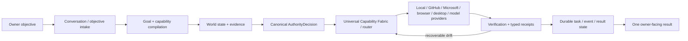

# Mahoraga

[](https://github.com/michaeljwilliams0123/mahoraga/actions/workflows/verify.yml)
[](https://github.com/michaeljwilliams0123/mahoraga/actions/workflows/pages.yml)

**Mahoraga is an owner-directed universal AI execution fabric.** One conversation can plan, route, execute, verify, recover, and continue work across registered local, cloud, repository, browser, desktop, Microsoft, agent, and model capabilities without making the owner select a provider for every step.

> **Canonical truth model:** GitHub `main` is the **private code authority** and source/evolution authority. A merged commit does not prove a deployment is current, and a healthy deployment does not prove every worker/provider is routable. Source truth, deployment truth, live-runtime truth, provider readiness, and execution authority are separate evidence domains and must stay separate.
>
> **Product identity:** the product name is simply **Mahoraga**. Semantic versions such as `7.0.0-alpha.2` remain build/provenance metadata, not user-facing product names. Repository visibility is an access setting, not an execution-authority signal; private source access does not itself grant Microsoft, relay, runtime, provider, or deployment authority.

## Current review baseline

This README was reconciled against protected `main` on **2026-09-13** through PR **#454** at `251ae071b72e196b6d0ee047c3cac85c5ae9bf1b`. That SHA is an audit anchor for this review, not a permanent claim that `main` will remain there.

At that review point:

- protected `main` required exact-head `Verify (ubuntu-latest)` and `Verify (windows-latest)` checks;
- squash was the only allowed protected-main merge method;
- no bypass actors were configured;
- GitHub remained the authoritative source ledger;
- GitLab remained a secondary assurance plane;
- Railway `mahoraga-runtime-main` remained the intended canonical cloud runtime/workspace service;
- merged source capability was ahead of fully observed live Railway capability, so deployment claims remained fail-closed.

## Capability-first architecture

Mahoraga plans against **capabilities, evidence, authority, and cost**, not vendor names. A user asks for an outcome; Mahoraga compiles the objective into required capabilities, observes current state, derives authority, ranks lawful routes, executes through the best admitted path, verifies results, persists receipts/state, and recovers or reroutes when a recoverable path drifts.



The architecture is intentionally fail-closed. A provider being installed, declared, enabled, or reachable does not make it routable by itself. The route must still satisfy current authority, data-class, identity, billing/cost, quota, provider health, canary/readiness, attendance, lease, provenance, and verification requirements.

## Truth boundaries

| Truth domain | What establishes it | What it does **not** prove |
| --- | --- | --- |
| **Source truth** | Protected GitHub `main`, exact commit SHA, ruleset, exact-head CI | That Railway or Windows is running that SHA |
| **Deployment truth** | Host/provider deployment metadata plus served source provenance | That all workers/providers are healthy or authorized |
| **Live-runtime truth** | Fresh runtime/process/listener/worker/provider observations | That source policy or CI gates were satisfied unless provenance is tied back to source |
| **Provider readiness** | Fresh provider + canary + quota/billing evidence | Owner authority for a side effect |
| **Execution authority** | Canonical `AuthorityDecision` and capability-specific policy | Provider readiness, cost eligibility, or successful execution |
| **Verification truth** | Capability-specific receipts/tests/postconditions | Broader authority than the verified action |

This separation is one of Mahoraga's core invariants. UI surfaces must show **unknown / unavailable / hold / degraded** when evidence is absent rather than inferring success from neighboring signals.

## Current repository state

| Area | Current source state |
| --- | --- |
| Product identity | `Mahoraga` (unversioned); semantic versions are provenance/build metadata |
| Runtime / control plane | Node 24 ESM `.mjs` across `src/`, `scripts/`, `test/`, and `relay/` |
| Browser workspace | TypeScript under [`cloud-app/`](cloud-app/); canonical owner-facing browser source |
| Operator helpers | [`operator-deck/`](operator-deck/) is a reference/control surface, not a second product/runtime |
| Durable operational state | SQLite WAL task/event state, leases, crash recovery, persistent objectives/conversations, typed receipts, encrypted content vault |
| Authority | Canonical `AuthorityDecision` envelope feeds routing/admission; callers cannot self-assert trusted provider/billing authority |
| Universal routing | UCF graph/ranked routing with evidence-aware recovery and fail-closed admission |
| Objective execution | Durable plan / challenge / synthesize / implement / verify / integrate flow |
| Answer execution | `assistant.respond` can route through verified zero-credit open-weight execution; licensed question-model plumbing remains separately governed and is not an automatic fallback for zero-credit requests |
| Zero-credit provider order | `codespaces-open-weight` → `local-open-weight` → deterministic-only / waiting state, subject to fresh evidence |
| Paid / metered model policy | No automatic paid/licensed fallback; metered OpenAI API execution remains disabled by default unless separately authorized |
| Relay | Authenticated/encrypted relay contracts with replay protection and continuity receipts |
| Browser / desktop | Provider-neutral browser contracts and attended Windows desktop capability boundaries |
| Microsoft | Graph/M365, Power Platform/Dataverse, Copilot Studio, PAC-backed discovery/admin, and bounded connected-agent/configuration contracts enter through the same authority/routing fabric |
| GitHub delivery | Protected `main`, exact-head cross-platform Verify, bounded repository execution, squash-only merge policy |
| GitLab assurance | Secondary runner/credential/head/repair assurance plane; never source authority |
| Windows production | Must be established from a fresh host probe; repository state alone is not production proof |
| Rollback predecessor | Protected predecessor remains `3.6.0` at `397acebf16766f44e3b4317f9d8b68b10de5f821` until governed activation evidence supersedes it |

## Latest accepted execution vertical

The most important recent source evolution is the cloud answer path assembled across the current repository line:

```text
owner UI/request
→ authenticated owner session / encrypted relay
→ canonical AuthorityDecision
→ provider + cost/quota admission
→ verified zero-credit model route
→ optional bounded tool/capability execution
→ durable task/event/result persistence
→ verified returned answer
```

The backend contract is now materially stronger than the older README described:

- **PR #424 — deployment provenance readiness:** production readiness can validate the running Railway Git SHA against the trusted expected SHA and fail closed on stale/missing provenance.
- **PR #430 — canonical authority envelope:** routing decisions can carry one normalized `AuthorityDecision` instead of scattered authority interpretations.
- **PR #431 — production relay continuity fix:** preserves required relay token state during production startup.
- **PR #432 — provider readiness reasons:** preserves explicit reason codes rather than collapsing readiness into a boolean.
- **PR #435 — encrypted relay simulator:** adds deterministic zero-credit security/communication simulation evidence; simulator evidence is diagnostic and must not be presented as proof of real model execution.
- **PR #441 — provider readiness UI:** carries provider-reason detail into the cloud workspace while preserving fail-closed routing.
- **PR #445 — zero-credit answer acceptance vertical:** adds fail-closed real-model execution for admitted zero-credit providers, canonical provider admission, billing/quota evidence checks, persistence, and routing coverage.
- **PR #450 — source-status reconciliation:** adds a dated source-truth reconciliation note while explicitly separating source from live-runtime truth.
- **PR #453 — Railway persistent-state permission repair:** initializes the mounted state directory at container start, repairs ownership, then drops privileges to `node` before Mahoraga runs.

Older architecture milestones remain important, but the README no longer treats a very long historical PR list as current-state documentation. Use Git history, the architecture specs, and the issue tracker for full chronology.

<details>
<summary><strong>Current reconciliation commit ledger (#405 → #454)</strong></summary>

This collapsed ledger records every main commit in the current identity/architecture reconciliation window before this docs-only follow-up. Git history remains authoritative.

- `251ae07` — docs(readme): reconcile current architecture, Railway state, and live gates (#454)
- `f438e57` — fix(railway): make mounted state volume writable without running Mahoraga as root (#453)
- `5750b04` — docs: reconcile Mahoraga current source truth (#450)
- `aeb8e0f` — feat: cloud zero-credit answer acceptance vertical (#445)
- `e63017d` — feat(ui): surface precise provider readiness reasons (#441)
- `6f48d11` — test(relay): add encrypted communication simulator (#435)
- `3ea9a2b` — fix(runtime): preserve provider readiness reasons (#432)
- `e8dcdec` — feat(authority): add canonical AuthorityDecision envelope (#430)
- `696b09c` — fix(runtime): preserve relay token in production startup (#431)
- `6d7a201` — feat(fabric): require free-tier quota admission (#380)
- `2d35016` — fix(workspace): stop treating Pages as the default origin (#416)
- `b152391` — fix(operator): remove stale public-repo wording (#421)
- `f440658` — feat(ui): expose interaction readiness in 7.0.0-alpha.2 workspace
- `823a63e` — fix(runtime): expose interaction readiness (#425)
- `0cb57ed` — docs(architecture): lock personal sovereign evolution model (#426)
- `0fd4fc4` — fix(cloud): enforce deployment provenance in readiness (#424)
- `aa58715` — fix(cloud): add startup provenance diagnostics (#423)
- `448af24` — feat(studio): validate connected-agent routing descriptions (#420)
- `189b522` — fix(studio): synchronize specialist display names safely (#419)
- `57ea67d` — fix(cloud): isolate production core port from inherited env (#417)
- `f83ef45` — fix(operator): align live Protect main ruleset ID (#411)
- `2f39397` — feat(studio): add bounded production PAC sync adapter (#402)
- `2961a6b` — fix(cloud): guard supervisor shutdown before idle timer init (#408)
- `702881e` — fix(runtime): persist quota backoff against active state root (#403)
- `fa3b43b` — docs(repo): align private-repo governance with live GitHub state (#406)
- `9ce6835` — Fix convergence with centralized candidate state (#404)
- `142c342` — fix(identity): keep runtime-facing product name unversioned (#405)

</details>

## Zero-credit answer admission

Mahoraga's zero-credit path is evidence-driven, not label-driven.

For an open-weight answer route to become eligible, source code requires the expected provider identity/cost class and current provider evidence. Missing, stale, or exhausted billing/quota/canary evidence must produce a hold/unavailable result rather than silently crossing into a paid provider.

Current source supports the zero-credit model configuration boundary through environment-backed values such as:

- `MAHORAGA_ZERO_CREDIT_MODEL_URL`
- `MAHORAGA_ZERO_CREDIT_MODEL_ID`
- optional `MAHORAGA_ZERO_CREDIT_MODEL_TOKEN`

Those variables describe an execution endpoint; they do **not** themselves prove zero-dollar eligibility. Cost/quota/provider evidence must still satisfy the admission contract.

A separately governed licensed question-model path may exist for explicitly permitted work. It is not an automatic fallback for zero-credit requests and must never be used to hide missing zero-credit readiness.

## Cloud / Railway production model

The intended canonical server-capable cloud service is Railway **`mahoraga-runtime-main`** in the `Mahoraga` project.

Current service configuration observed during this README reconciliation:

- source repository: `michaeljwilliams0123/mahoraga`;
- branch/source intent: authoritative `main`;
- builder: root `Dockerfile`;
- public service domain: `mahoraga-runtime-main-production.up.railway.app` on port `3000`;
- start command: `node scripts/cloud-service.mjs`;
- Railway platform healthcheck: `/api/live`;
- stricter application/provenance readiness boundary: `/api/ready`;
- persistent volume: `500 MB` mounted at `/var/lib/mahoraga`;
- canonical state directory: `MAHORAGA_STATE_DIR=/var/lib/mahoraga` in the production image.

### Liveness is not readiness

Railway's platform healthcheck intentionally targets `/api/live`. That endpoint answers the narrow question: **is the workspace/container listener alive?**

Mahoraga's `/api/ready` is stronger and may return non-200 while the container is alive. It can incorporate deployment provenance and paired-core/application readiness. Do not weaken `/api/ready` merely to make Railway green, and do not report `/api/live = 200` as proof that Mahoraga can execute an owner request.

### Persistent state and privilege drop

Railway mounts volumes at runtime. A build-time `chown` is therefore insufficient because the mounted directory can replace the image-owned path with a root-owned mount.

Current source handles that boundary through [`scripts/docker-entrypoint.sh`](scripts/docker-entrypoint.sh):

1. resolve `${MAHORAGA_STATE_DIR:-/var/lib/mahoraga}`;
2. create the directory if necessary;
3. repair ownership to `node:node`;
4. immediately execute the application through `gosu node`.

Mahoraga itself does **not** run as root. The root bootstrap exists only to establish writable mounted state before privilege drop.

## Observed cloud status during this README reconciliation

> **Time-sensitive snapshot — 2026-09-13.** This subsection records what was observed while updating the README. It is not a promise that deployment state remains unchanged after the documentation commit.

- GitHub protected `main` at the second-pass source check: `251ae071b72e196b6d0ee047c3cac85c5ae9bf1b` (PR #454 merged).
- Railway canonical service: `mahoraga-runtime-main`.
- Railway volume: mounted at `/var/lib/mahoraga`.
- Latest Railway deployment observed during the review: **DEPLOYING**, but still tied to older source commit `5750b04b4281509b7533f46a571265aaff52411d` rather than the then-current GitHub head.
- Therefore the #453 volume-permission repair was merged in source but **not yet proven live on the canonical Railway service** during this snapshot.
- Legacy/non-canonical Railway services still existed (`mahoraga-runtime-direct`, an older failed `mahoraga-runtime`, plus empty candidate/fresh service records). They must not silently become production authority or fallback routes.
- The canonical Railway variable-name set did not yet expose `MAHORAGA_CLOUD_OWNER_ID` or the zero-credit model URL/model variables during this review. Fresh owner-session admission and live zero-credit model execution therefore remained unproven.

This is why issue [#377](https://github.com/michaeljwilliams0123/mahoraga/issues/377) remains the deployment-convergence authority: source readiness and a running container are not enough; the canonical service must serve the intended exact `main` provenance and pass the separate live/readiness acceptance checks.

## Owner session / cloud gateway

A fresh browser session is not supposed to self-assert owner identity. The server-side session boundary requires the configured owner identity plus a valid signed assertion from the owner gateway.

Current owner-gateway code expects `MAHORAGA_CLOUD_OWNER_ID` and signed owner headers. The Cloudflare owner-gateway implementation can proxy an HTTPS origin while keeping the runtime itself behind an authenticated owner route. Historical variable names such as `MAHORAGA_FLY_ORIGIN` are transport-era naming, not a requirement that the runtime be hosted on Fly.

The intended pattern is:

```text
owner browser
→ authenticated owner gateway / Access boundary
→ signed owner assertion
→ Mahoraga cloud session
→ runtime request
```

If the owner identity/gateway is absent, session establishment must fail closed. Do not replace that boundary with an unauthenticated public session just to make the UI interactive.

## Workspace and UI surfaces

- **Canonical browser source:** [`cloud-app/`](cloud-app/)
- **Production server-capable target:** Railway `mahoraga-runtime-main`, once exact-source deployment and owner-session readiness are freshly proven.
- **GitHub Pages:** GitHub Pages is an optional derived static export. It is not runtime authority and cannot expose server-only action/session routes.
- **Operator reference/control helpers:** [`operator-deck/`](operator-deck/) — not a second Mahoraga runtime.
- **Loopback control API:** defaults to `127.0.0.1:4782`; never expose this as a generic public API.
- **Vercel:** historical/retired from the active production-completion path; it is not a required PR/deployment gate.
- **Netlify:** fallback hosting only; it does not change Mahoraga authority.

GitHub `main` is the private code authority for the workspace. Deployment availability is observed separately from source verification. The runtime-configured `MAHORAGA_WORKSPACE_URL` / `MAHORAGA_WORKSPACE_ORIGIN` defines the canonical production origin after exact-head deployment and pairing verification. GitHub Pages remains optional; neither its historical URL nor any replacement host is canonical until the configured production origin is proven on the exact authoritative source SHA and passes the required pairing/health checks.

The UI should expose evidence without inventing it. Current open UI follow-ups intentionally separate real runtime receipts from simulations:

- [#451](https://github.com/michaeljwilliams0123/mahoraga/issues/451) — surface zero-credit admission, provider/cost class, quota/billing freshness, and hold/deny reasons from canonical runtime evidence.
- [#452](https://github.com/michaeljwilliams0123/mahoraga/issues/452) — surface a real encrypted-relay → authority → model → persistence → answer receipt chain without presenting simulator evidence as production execution.

## Capability families

Mahoraga can register multiple routes for one capability and multiple capabilities from one provider. `enabled` is not synonymous with `routable`.

- **Deterministic local:** supervisor, local core, task/event store, repository worker, self-healer, verification, release/update logic.
- **Repository / delivery:** GitHub, GitLab assurance, Actions, releases, repository coordination, bounded implementation lanes.
- **Model / answer:** zero-credit open-weight execution plus separately governed licensed/model routes under explicit cost and authority policy.
- **Browser:** provider-neutral browser contracts and signed-session/cloud browser work behind bounded authority.
- **Desktop:** attended Windows/application capabilities for work that cannot be satisfied through a native connector/API.
- **Microsoft:** Graph/M365, Copilot Studio, Dataverse/Power Platform, Power Apps/flows, PAC-backed discovery/administration, and bounded configuration/delegation routes.
- **MCP / connectors:** typed transports can expose additional capabilities without granting themselves broader authority.
- **Local / future providers:** new providers can enter through the same capability graph if they satisfy evidence, authority, cost, and verification contracts.

## Microsoft and Power Platform direction

Microsoft remains a **provider family**, not a second Mahoraga brain.

Preferred transport order:

1. native authenticated Graph / Power Platform / Copilot Studio / connector APIs;
2. PAC-backed discovery and bounded administration;
3. a narrowly scoped, expiring callback transport only when an integration genuinely requires inbound reachability and no outbound/native path is practical.

The default Microsoft cost posture is zero-credit first. `deterministic-zero` and runtime-attested `license-included` routes may be eligible; `metered` and `unknown` routes remain blocked under the default zero-credit policy unless the owner separately authorizes spend.

See [`docs/superpowers/specs/2026-09-10-power-platform-ucf-provider-design.md`](docs/superpowers/specs/2026-09-10-power-platform-ucf-provider-design.md).

## GitHub authority and merge governance

Protected `main` is governed by the active ruleset **`Protect main - exact-head Verify`**.

At this README review point the active ruleset required:

- pull requests for protected `main` changes;
- squash merge as the allowed merge method;
- strict exact-head status checks;
- `Verify (ubuntu-latest)`;
- `Verify (windows-latest)`;
- no deletion / non-fast-forward updates to protected `main`;
- no configured bypass actors; the current owner connection cannot bypass the ruleset.

A stale successful workflow is not merge evidence for a newer head. Every protected change must be evaluated at its exact current PR SHA.

Codex is **not** a Mahoraga code-review transport. Do not spend Codex credits to obtain or retry review. Deterministic repository verification is the required merge authority.

## GitLab assurance plane

GitLab is deliberately secondary to GitHub. It can independently prove runner health, credential readiness, GitHub-head observation, and bounded repair-decision logic, but it does not become source authority and a GitLab SHA must not be presented as the GitHub source SHA.

Historical GitLab MR `!3` is merged and retains its exact-head shared-runner smoke evidence. During this README reconciliation, the latest observed GitLab `main` assurance pipeline was successful and included:

- contract tests;
- shared-runner smoke;
- GitHub credential readiness;
- GitHub-head assurance;
- repair-dispatch decision;
- repair confirmation.

Treat that as **assurance-plane health**, not proof that Railway or Windows is running current GitHub `main`.

## Verification

The canonical repository gate is deterministic and zero-model-credit:

```powershell
npm.cmd run validate
npm.cmd run verify
```

On non-Windows shells:

```bash
npm run validate
npm run verify
```

`npm run verify` validates the runtime manifest, product identity, coordination contracts, GitHub/Codex handshakes, self-upgrade contract, repository assurance, live-protection expectations, PDF authority, release/repair baseline integrity, and the Node test suite.

Useful bounded checks:

```powershell
npm.cmd run status
npm.cmd run providers:probe
npm.cmd run gap:audit
npm.cmd run github:audit
npm.cmd run review:adaptive -- "<owner direction>"
```

Provider discovery is not proof of task readiness. Write-capable or side-effecting routes require current authority and fail closed when the required provider, canary, authentication, attendance, lease, cost, quota, or integration evidence is missing.

### Windows path examples

Windows launchers must derive the current user's profile dynamically rather than committing a machine/user-specific path. The contract uses `[Environment]::GetFolderPath('UserProfile')` and must not hard-code a `C:\Users\<name>` path in tracked documentation or launchers.

## Repository rules for agents and contributors

Before editing, read [`AGENTS.md`](AGENTS.md), [`docs/ECOSYSTEM-LOCK.md`](docs/ECOSYSTEM-LOCK.md), and [`.github/copilot-instructions.md`](.github/copilot-instructions.md).

Core rules:

- `cloud-app/` and `operator-deck/` stay TypeScript; do not rewrite the UI as JavaScript.
- `src/`, `scripts/`, `test/`, and `relay/` stay Node ESM `.mjs` unless a bounded migration is explicitly approved.
- Preserve idempotency, leases, crash recovery, typed receipts, immutable/release baselines, exact-head verification, canaries, rollback, and owner stop/override authority.
- Keep credentials, tokens, cookies, private content, tenant identifiers, and secret-bearing diagnostics out of Git, coordination artifacts, model prompts, and ordinary logs.
- Do not add an unrestricted supervisor shell, arbitrary caller-selected executable, broad UI automation interpreter, or generic public loopback aperture.
- Do not use Codex for code review or spend credits to recover from review-bot quota conditions.
- Do not treat a model refusal as permission to replace or simplify the architecture.
- Any remote aperture must be capability-scoped, authenticated, auditable, independently validated, and closed/expired according to policy.
- Ordinary chat/PR work does not directly activate a new Windows production candidate; activation belongs to the governed release/evolution channel.

## Current unresolved live gates

The following are intentionally tracked as **gates**, not papered over as success:

| Gate | Current meaning |
| --- | --- |
| [#377 Railway convergence](https://github.com/michaeljwilliams0123/mahoraga/issues/377) | One canonical Railway production service must repeatedly deploy authoritative `main`, expose exact served provenance, keep liveness/readiness distinct, and prevent stale services from regaining authority |
| [#388 Windows runtime convergence](https://github.com/michaeljwilliams0123/mahoraga/issues/388) | Repository evolution must not be confused with the paired Windows runtime; live host evidence is still required before claiming the Windows brain is current/healthy |
| [#412 private-repo operator reads](https://github.com/michaeljwilliams0123/mahoraga/issues/412) | `operator-deck` needs authenticated server-side GitHub reads and must fail closed rather than falling back to misleading public-state assumptions |
| [#451 zero-credit UI evidence](https://github.com/michaeljwilliams0123/mahoraga/issues/451) | UI still needs complete canonical zero-credit provider/quota/billing observability |
| [#452 execution receipt chain](https://github.com/michaeljwilliams0123/mahoraga/issues/452) | UI still needs a real relay/authority/model/persistence/answer receipt chain tied to one transaction |

Other open issues may represent future capability work rather than current production blockers; use the issue tracker for the complete queue.

## Release and runtime truth

`7.0.0-alpha.2` remains repository build/candidate metadata. It is **not** the product name and a merged source head does not prove that a Windows machine or Railway service has loaded it.

The protected rollback predecessor remains `3.6.0` at `397acebf16766f44e3b4317f9d8b68b10de5f821` until a later candidate completes the governed activation, canary, checkpoint, state, and rollback evidence required to supersede it.

The governing rule is simple:

**source truth ≠ deployment truth ≠ live-runtime truth ≠ provider readiness ≠ execution authority.**

Mahoraga should make each of those states observable, preserve their provenance, and refuse to invent the missing links.

## Key architecture and status documents

- [Current source-status reconciliation — 2026-09-13](docs/MAHORAGA-CURRENT-STATUS-2026-09-13.md)
- [Universal Capability Fabric design](docs/superpowers/specs/2026-09-10-universal-capability-fabric-design.md)
- [Power Platform UCF provider design](docs/superpowers/specs/2026-09-10-power-platform-ucf-provider-design.md)
- [Personal sovereign evolution model](docs/superpowers/specs/2026-09-12-personal-sovereign-evolution-design.md)
- [Cloud workspace contract](docs/CLOUD-WORKSPACE.md)
- [Always-on cloud runtime](docs/CLOUD-ALWAYS-ON-RUNTIME.md)
- [Provider adapter contracts](docs/PROVIDER-ADAPTER-CONTRACTS.md)
- [Update channel](docs/UPDATE-CHANNEL.md)
- [Zero-credit automation](docs/ZERO-CREDIT-AUTOMATION.md)
- [Credit-free autonomy](docs/CREDIT-FREE-AUTONOMY.md)
- [GitHub operations](docs/GITHUB-OPERATIONS.md)
- [Ecosystem lock](docs/ECOSYSTEM-LOCK.md)
- [Historical production/repository status](docs/PRODUCTION-STATUS.md)

## Useful repository surfaces

- GitHub Actions: <https://github.com/michaeljwilliams0123/mahoraga/actions>
- Pull requests: <https://github.com/michaeljwilliams0123/mahoraga/pulls>
- Issues / task intake: <https://github.com/michaeljwilliams0123/mahoraga/issues>
- Releases: <https://github.com/michaeljwilliams0123/mahoraga/releases>

Keep the owner experience simple, but keep the underlying truth explicit: **one objective in, evidence-backed execution out.**