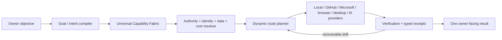

# Mahoraga

[](https://github.com/michaeljwilliams0123/mahoraga/actions/workflows/verify.yml)
[](https://github.com/michaeljwilliams0123/mahoraga/actions/workflows/pages.yml)

**Mahoraga is an owner-directed universal AI execution fabric.** One conversation can plan, route, execute, verify, recover, and continue work across registered local, cloud, repository, browser, desktop, Microsoft, agent, and model capabilities without making the owner choose a provider for every step.

> **Repository truth:** this repository is **private** and `main` is the canonical source. The product identity is simply **Mahoraga**. Semantic versions remain internal build/provenance metadata rather than product names. Repository visibility is not a runtime or Microsoft authority signal, and repository state does not prove live-host state; runtime claims require fresh observed evidence.

## The current idea

Mahoraga plans against **capabilities, not vendors**. A user asks for an outcome; Mahoraga decides which registered route can satisfy each part of the objective under the current authority, identity, data, health, cost, and verification constraints.



Provider outages, stale sessions, quota conditions, and route drift are treated as recoverable objective state when another lawful route can be refreshed, repaired, substituted, or provisioned. The objective lineage and idempotency identity stay intact across route changes.

## Current repository state

| Area | Current state |
| --- | --- |
| Product identity | `Mahoraga` (unversioned); semantic versions remain build/provenance metadata |
| Repository visibility | Private; source access does not grant runtime, Microsoft, relay, or deployment authority |
| Repository build metadata | Tracked in package/manifest provenance; not part of the Mahoraga product name |
| Control plane | Node 24 ESM `.mjs` |
| Browser workspace | TypeScript in `cloud-app/`; one deployable UI source |
| Control Center truth | Public identity stays Mahoraga; build version is provenance-only; runtime DB display is basename-only; Studio management-plane and delegation-runtime readiness are shown separately and fail closed; the evolution lane mirrors verified convergence rather than implying direct activation authority |
| Operational state | SQLite WAL task/event state + encrypted local content vault |
| Universal routing | UCF graph v2, richer route metadata, ranked routing, adaptive recovery |
| Autonomous objectives | Durable plan / challenge / synthesize / implement / verify / integrate flow |
| Adaptive directive review | Direction -> compile -> relevant lessons -> delta evidence -> impact map -> verify -> learn; depth adapts by policy and evidence freshness |
| Repository execution | Bounded repository worker + exact-head verification contracts |
| Question answering | `assistant.respond` uses a transient read-only Codex question model; readiness requires the CLI to be callable, stale provider-derived canaries refresh in place, and idle workers proactively renew stale canary evidence before new work arrives |
| Runtime provenance and convergence | Paired core derives exact source-commit provenance, refreshes authoritative `origin/main` identity every 30 seconds, reports `current`, `runtime-drift`, or `unknown`, and the Windows convergence controller can promote a verified drifted candidate only through exact-head, canary, durable-state, and rollback gates |
| Browser / desktop | Provider-neutral browser and attended Windows desktop contracts |
| GitHub ⇄ Copilot Studio learning | Verified/approved metadata admission and authenticated runtime ingestion bridge merged; live activation still requires exact-head promotion/observation |
| Microsoft / Power Platform | UCF provider-family design and Copilot Harness Assist Fabric are merged; Windows Node 24 PAC discovery uses a constrained compatibility launcher limited to deterministic `auth list` / `copilot list`; metered Copilot-credit routes remain excluded from zero-credit policy |
| Metered OpenAI API | Disabled by default |
| Public exposure | Persistent public exposure prohibited; public `/api/status` is redacted to non-sensitive health/routing state while deployment identity stays authenticated |
| Windows production truth | Must be established from a fresh live-host probe; repository state alone is not proof |
| Rollback predecessor | `3.6.0` at `397acebf16766f44e3b4317f9d8b68b10de5f821` |

## What changed recently

Mahoraga's current `main` is materially ahead of the older runtime baseline:

- **Universal Capability Fabric:** PR [#289](https://github.com/michaeljwilliams0123/mahoraga/pull/289) added graph-v2 route metadata, deterministic recovery planning, recovery-aware routing, objective requeue across recoverable route drift, conversation capability planning, and startup recovery.
- **Destiny bridge hardening:** PR [#291](https://github.com/michaeljwilliams0123/mahoraga/pull/291) hardened the bridge on the current repository line.
- **GitHub ⇄ Copilot Studio learning:** PR [#292](https://github.com/michaeljwilliams0123/mahoraga/pull/292) added a zero-credit, metadata-only peer-learning contract for mapping verified lessons toward institutional memory without persisting prompts, chats, or credentials; the authenticated runtime ingestion bridge is now merged, while live activation remains deployment-observed.
- **Power Platform UCF provider family:** PR [#293](https://github.com/michaeljwilliams0123/mahoraga/pull/293) defined the Microsoft provider family behind UCF rather than a second orchestration brain.
- **Cloud runtime compatibility diagnostics:** PR [#298](https://github.com/michaeljwilliams0123/mahoraga/pull/298) added explicit cloud-session compatibility diagnostics so the workspace can distinguish an unreachable runtime from a reachable-but-incompatible one.
- **Static Pages workspace export:** PR [#299](https://github.com/michaeljwilliams0123/mahoraga/pull/299) made GitHub Pages publish the canonical browser workspace without exposing server-only session or action routes.
- **Verified Copilot Studio learning admission:** PR #303 added a bounded adapter that converts verified and approved Studio learning metadata into peer-learning events. The admission contract is merged. PR #312 adds the authenticated runtime ingestion bridge; deployed/live status still requires exact-head promotion and observation.
- **Public status hardening:** the public `/api/status` projection exposes non-sensitive queue provider/state while keeping Dataverse environment name, GUID, and tenant CRM URL out of the unauthenticated response; authenticated status retains the full deployment view.
- **Question-model readiness:** PR [#313](https://github.com/michaeljwilliams0123/mahoraga/pull/313) hardened `assistant.respond` readiness so the health probe performs a zero-credit `codex --version` callability check and fails closed when the executable cannot run.
- **Immutable runtime provenance:** PR [#315](https://github.com/michaeljwilliams0123/mahoraga/pull/315) binds paired-core status to an exact source commit and expected source commit, making same-version/different-commit drift machine-distinguishable without a model call.
- **Cloud provenance truth boundary:** PR [#316](https://github.com/michaeljwilliams0123/mahoraga/pull/316) keeps the browser/cloud health projection non-authoritative: unpaired cloud health reports runtime provenance as `unknown` until the paired Mahoraga core supplies it.
- **Stale-canary recovery:** PR [#318](https://github.com/michaeljwilliams0123/mahoraga/pull/318) executes the recovery planner's existing `refresh-readiness` action by sending `readiness.refresh` to the selected worker before retry, allowing long-running healthy providers to renew readiness evidence without a process restart.
- **Authoritative runtime-drift detection:** PR [#322](https://github.com/michaeljwilliams0123/mahoraga/pull/322) refreshes authoritative `origin/main` provenance every 30 seconds and exposes `authoritativeSourceCommit`, so a long-running paired core can move from `current` to `runtime-drift` when canonical `main` advances after startup, without invoking a model.
- **Canonical product identity:** PR [#323](https://github.com/michaeljwilliams0123/mahoraga/pull/323) makes `Mahoraga` the single public/product name across browser and operator surfaces while keeping semantic versions as build/provenance metadata.
- **Runtime listener truth:** PR [#324](https://github.com/michaeljwilliams0123/mahoraga/pull/324) makes runtime health/status report the actual bound listener port, including explicit or ephemeral port overrides, instead of echoing the manifest default.
- **Safe Windows PAC discovery:** PR [#325](https://github.com/michaeljwilliams0123/mahoraga/pull/325) fixes Node 24 PAC discovery on Windows through a constrained `cmd.exe` compatibility path that allowlists only `pac auth list` and `pac copilot list`; non-Windows execution remains direct and the path does not invoke a model or consume Copilot credits.
- **Frozen loaded-source provenance:** PR [#327](https://github.com/michaeljwilliams0123/mahoraga/pull/327) preserves the process-start source SHA while authoritative `origin/main` refreshes, so a long-running runtime cannot falsely relabel itself as newly merged code; drift remains explicit until a real restart/promotion loads the new source.
- **Startup source convergence:** PR [#329](https://github.com/michaeljwilliams0123/mahoraga/pull/329) makes the Windows production launcher require the live runtime provenance `sourceCommit` to match the checkout's exact `git rev-parse HEAD`, preventing same-version stale processes from being accepted as current.
- **Cloud readiness cockpit:** PR [#330](https://github.com/michaeljwilliams0123/mahoraga/pull/330) distinguishes a healthy published GitHub Pages shell from a paired execution core, replaces misleading unpaired `Offline` language with `Ready to pair`, and adds the Eclipse telemetry cockpit without granting the browser shell execution authority.
- **Runtime-targeted CLI state:** PR [#333](https://github.com/michaeljwilliams0123/mahoraga/pull/333) makes `start`, `status`, and `submit` honor the same explicit runtime database target, preventing operator commands from silently inspecting a different SQLite state file.
- **Verified live-brain convergence:** PR [#351](https://github.com/michaeljwilliams0123/mahoraga/pull/351) added the zero-credit Windows convergence controller that advances a drifted paired core only after exact protected-main identity, candidate verification, canary readiness, state migration, and rollback checks succeed.
- **Idle readiness renewal:** PR [#353](https://github.com/michaeljwilliams0123/mahoraga/pull/353) makes the supervisor renew stale canary evidence while a worker is truly idle, with a single in-flight refresh guard; queued work retains the task-driven recovery and attempt contract.
- **Windows convergence trigger compatibility:** PR [#357](https://github.com/michaeljwilliams0123/mahoraga/pull/357) creates the one-minute convergence recurrence through supported ScheduledTasks parameters, preserving the existing exact-head, canary, durable-state, and rollback boundaries.
- **Canonical Railway container:** PR [#368](https://github.com/michaeljwilliams0123/mahoraga/pull/368) makes Railway use the same Node 24 cloud container definition as the governed cloud runtime instead of a divergent Railpack-detected build path.
- **Encrypted relay continuity:** PR [#370](https://github.com/michaeljwilliams0123/mahoraga/pull/370) adds bounded encrypted relay continuity across runtime replacement, including authenticated reattach/keepalive state and protected local continuity storage. Merge status does not prove a stale paired runtime has converged; live provenance remains authoritative.
- **Adaptive review loop:** owner directions can now be compiled into bounded impact surfaces, relevant institutional lessons, freshness-aware evidence ladders, contradiction classes, and a deterministic stop condition before implementation expands scope.
- **Control Center operator truth:** the canonical cloud workspace now keeps `Mahoraga` as the public identity while surfacing build provenance separately, exposes only the runtime database basename, distinguishes Copilot Studio management-plane readiness from delegation-runtime readiness, and describes core evolution as stage → verify → canary → converge without widening browser authority.

## Owner experience

### Adaptive review CLI

Use `npm run review:adaptive -- "<owner direction>"` to compile a deterministic, zero-credit review contract before implementation. It identifies affected surfaces, constraints, evidence escalation order, and impact chains without activating providers or making a model call.

The intended interaction model is deliberately simple:

1. Give Mahoraga one objective in the conversation.
2. Mahoraga compiles the objective into capability requirements.
3. UCF ranks eligible routes using authority, data class, authentication state, health, cost, reliability, latency, workload, attendance, idempotency, and recovery quality.
4. Work executes through the best lawful route available at that moment.
5. Results are verified with capability-specific evidence and typed receipts.
6. Recoverable failures refresh, retry, repair, or reroute without forcing the owner to restart the objective.
7. The owner receives one synthesized result; route details remain diagnostic metadata in advanced/control surfaces.

Interactive sign-in or consent can still appear when an external platform requires it. That becomes a resumable authentication wait state rather than a new objective.

## Capability families

Mahoraga can register multiple routes for the same capability and multiple capabilities from one provider. Declared or enabled does not automatically mean routable; a route still needs current process/provider/canary/authority evidence.

- **Deterministic local:** supervisor, local core, repository worker, self-healer, task store, verification, release/update logic.
- **Repository / delivery:** GitHub, GitLab, Actions, releases, repository coordination, bounded builder lanes.
- **Browser:** browser status and provider-neutral browser contracts; interactive browser execution remains isolated from the loopback control plane.
- **Desktop:** attended Windows/application capability contracts for work that cannot be satisfied through a native API or connector.
- **OpenAI / Codex:** bounded builder and coordination routes subject to declared authority, readiness, and spending policy; Codex is not a code-review transport.
- **Microsoft:** Graph/M365, Copilot Studio, Dataverse/Power Platform, Power Apps/flows, and queue capabilities progressively entering UCF behind explicit billing/authority admission.
- **Local / future models:** local reasoning and future adapters can be admitted through the same capability graph without replacing the planner.
- **MCP / connectors:** fixed, validated transports can expose additional capabilities without granting themselves broader authority.

## Microsoft and Power Platform direction

The current design treats Microsoft as a **provider family**, not as a separate Mahoraga brain. Preferred transport order is:

1. Native authenticated Power Platform / Copilot Studio / Graph / connector APIs.
2. PAC-backed discovery and bounded administration.
3. A narrowly scoped, expiring callback transport only when a Microsoft integration genuinely requires inbound reachability and no outbound/native path is practical.

The default Microsoft admission policy is zero-credit first. `deterministic-zero` and runtime-attested `license-included` routes may be eligible; `metered` and `unknown` routes stay blocked under the default zero-credit policy. No paid fallback is automatic.

See [`docs/superpowers/specs/2026-09-10-power-platform-ucf-provider-design.md`](docs/superpowers/specs/2026-09-10-power-platform-ucf-provider-design.md).

## Workspace and control surfaces

- **Canonical browser source:** [`cloud-app/`](cloud-app/)
- **Browser deployment:** `cloud-app/` is host-neutral. The runtime-configured `MAHORAGA_WORKSPACE_URL` / `MAHORAGA_WORKSPACE_ORIGIN` defines the canonical production origin after exact-head deployment and pairing verification. GitHub Pages is an optional derived static export, not production authority.
- **Operator reference/control helpers:** [`operator-deck/`](operator-deck/) — not a second deployable UI.
- **Loopback control API:** defaults to `127.0.0.1:4782`; when startup overrides the port, runtime status reports the actual bound listener. Do not expose this listener directly to the public internet.
- **GitHub Actions:** https://github.com/michaeljwilliams0123/mahoraga/actions
- **Pull requests:** https://github.com/michaeljwilliams0123/mahoraga/pulls
- **Issues / task intake:** https://github.com/michaeljwilliams0123/mahoraga/issues
- **Releases:** https://github.com/michaeljwilliams0123/mahoraga/releases

GitHub `main` is the private code authority for the workspace. Deployment availability is observed separately from source verification: a green `Verify Mahoraga` run does not prove that Pages or another host is live. The active browser source is host-neutral `cloud-app/`; whichever server-capable or static host is selected remains a replaceable transport rather than a second product or authority plane. GitHub Pages may publish a derived static export when enabled, but neither its historical URL nor any replacement host is canonical until the configured production origin is proven on the exact `main` SHA and passes the required pairing/health checks. Vercel is paused/historical and Netlify remains fallback-only.

The browser workspace is a client of the paired Mahoraga core. GitHub source verification, Pages availability, and live Windows runtime health are separate facts and should be reported separately. Deployment metadata can identify the browser build, but authoritative runtime provenance comes only from the paired core; an unpaired cloud surface must report runtime provenance as `unknown` rather than infer it from environment variables.

## Repository hygiene

Mahoraga keeps `main` as the long-lived code authority and treats implementation branches as disposable delivery lanes. Fully merged remote branches should be pruned after their work lands. Branches backing closed PRs that GitHub explicitly records as duplicate, empty WIP, superseded, or abandoned should also be retired instead of preserved indefinitely merely because squash/rebase history makes their commits appear unique. Unmerged branches without an explicit retirement decision are retained for merge/extract review. Generated state, historical release receipts, and rollback baselines are not "dead code" and should not be deleted merely because a newer candidate exists.

## Verification

Mahoraga's canonical repository gate is deterministic and zero-model-credit:

```powershell
npm.cmd run validate
npm.cmd run verify
```

On non-Windows shells, `npm run validate` and `npm run verify` are equivalent. Windows launcher/reference code derives the current profile dynamically with `GetFolderPath('UserProfile')`; do not commit a username or a user-specific absolute path.

`npm run verify` validates the runtime manifest, product identity, coordination contracts, GitHub/Codex handshakes, self-upgrade contract, repository assurance, live-protection expectations, PDF authority, repair baseline, and the Node test suite. Exact-head GitHub verification remains the merge authority for protected work.

Useful bounded checks:

```powershell
npm.cmd run status
npm.cmd run providers:probe
npm.cmd run gap:audit
npm.cmd run github:audit
```

Provider discovery or an enabled manifest flag is not proof of task readiness. Write-capable routes require current evidence and fail closed when the required provider, canary, authentication, attended session, or integration lease is absent.

## Repository rules for AI agents

Before editing, read [`AGENTS.md`](AGENTS.md), [`docs/ECOSYSTEM-LOCK.md`](docs/ECOSYSTEM-LOCK.md), and [`.github/copilot-instructions.md`](.github/copilot-instructions.md).

The short version:

- `cloud-app/` and `operator-deck/` stay TypeScript; do not rewrite the product as JavaScript.
- `src/`, `scripts/`, `test/`, and `relay/` stay Node ESM `.mjs` unless a bounded migration is explicitly started.
- Preserve task idempotency, crash recovery, typed receipts, repair baseline, exact-head verification, canaries, rollback, and owner stop/override authority.
- Keep credentials, tokens, private content, tenant identifiers, cookies, and other secrets out of Git, coordination artifacts, ordinary diagnostics, and model prompts.
- Do not use Codex as a code-review path or spend credits to recover from review-bot quota conditions.
- Do not treat a model refusal as permission to replace or simplify the architecture.
- The loopback API must never become a generic public endpoint. Any remote aperture must be capability-scoped, authenticated, time-bounded, auditable, independently validated, and automatically closed.
- Do not activate `7.0.0-alpha.1` or `7.0.0-alpha.2` on Windows from an ordinary chat/PR flow; activation belongs to the governed release/evolution channel with canary, checkpoint, and rollback evidence.

## Key architecture documents

- [Universal Capability Fabric design](docs/superpowers/specs/2026-09-10-universal-capability-fabric-design.md)
- [Power Platform UCF provider design](docs/superpowers/specs/2026-09-10-power-platform-ucf-provider-design.md)
- [Production / repository truth](docs/PRODUCTION-STATUS.md)
- [Cloud workspace contract](docs/CLOUD-WORKSPACE.md)
- [Update channel](docs/UPDATE-CHANNEL.md)
- [Zero-credit automation](docs/ZERO-CREDIT-AUTOMATION.md)
- [Credit-free autonomy](docs/CREDIT-FREE-AUTONOMY.md)
- [GitHub operations](docs/GITHUB-OPERATIONS.md)
- [Ecosystem lock](docs/ECOSYSTEM-LOCK.md)

## Release truth

`7.0.0-alpha.2` is the repository candidate line. A merged change, green hosted workflow, or manifest declaration does not by itself prove that a particular Windows machine is running that candidate. Live production claims require fresh process/listener/version/worker/provider evidence from the target host.

The repository's protected rollback predecessor remains `3.6.0` until a later candidate completes its governed activation, canary, checkpoint, and rollback evidence. This distinction is intentional: **source truth, deployment truth, and live-runtime truth are separate.**