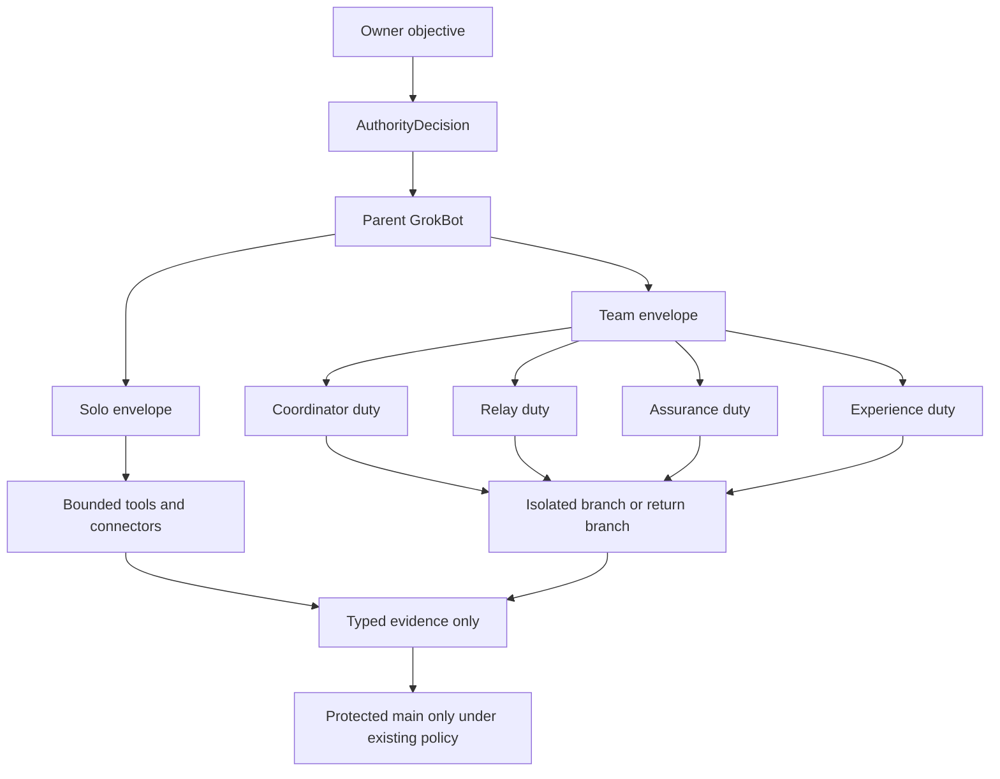

# GrokBot architecture

This is an introduction and a tie-out. It does not register a capability, admit a provider, open a review lane, change authority, or activate a device.

A **GrokBot** is one bounded conversational executor. It plans, calls tools, checks the actual result, and reports evidence. It is not a trust root, not a second Mahoraga, and not a code-review path. Vendor and host are transport. Authority stays the intersection already defined in [`AUTONOMY-MODEL.md`](AUTONOMY-MODEL.md):

```text
effectiveAuthority = ownerGrant ∩ platformGrantedPermissions ∩ registeredCapability
```

Permanent child bots do not skip that intersection. `resolveBotOperationalAuthority` still requires fresh matching objective and authority digests, source SHA, trust epoch, evaluator fingerprint, cost class, audience, and security boundary. Drift fails closed. Ownership transfer, permanent recovery removal, destruction of every rollback generation, and root-credential transfer stay with the owner.

Until a GrokBot capability is explicitly registered, this document is source explanation only. Writing it is not deployment truth, live-runtime truth, provider readiness, or an execution receipt.

## Where it sits

Mahoraga already has equal controllers, scoped implementers, specialist profiles, and dispatch lanes. A GrokBot joins that roster as an executor. It does not collapse those lanes into one bot.



Neighboring lanes stay distinct:

| Lane | What it already is | What a GrokBot must not pretend it is |
| --- | --- | --- |
| `primary-local-codex`, `primary-cloud-codex` | Equal controllers. Location is transport, not rank. | A second primary. Holding no integration lease means no integration. |
| Secondary Codex | Implements one assignment and returns `secondary/<assignment-id>`. | A pusher of `main`. |
| Destiny Event Dispatch | Owner-authored PR plus a hash-bound envelope. Identity is `unconfigured` until a dedicated actor is admitted. | The Destiny Cipher Relay. Delivery is not execution. |
| Workspace Agent receiver | Read-only Actions receiver for one assignment. | A second receiver on a task area that already has the Windows poller. |
| Copilot profiles under `.github/agents/` | Explicit specialist surfaces. | A new trust authority or a self-merge path. |
| Cognitive mitosis | Forecast clones of the incumbent core. Parent state stays put. | Proof that an LLM ran, or that a proposed action executed. |
| Zero-credit answer path | Admitted only with fresh cost and quota evidence. | A paid fallback when a usage limit is hit. |

GitHub remains the shared coordination surface. Chats, prompts, model responses, browser data, and credentials stay out of it. See [`GITHUB-CODEX-COORDINATION.md`](GITHUB-CODEX-COORDINATION.md) and [`AGENT-EXECUTION-PROTOCOL.md`](AGENT-EXECUTION-PROTOCOL.md).

## Independent GrokBot

One bot, one user thread, one working context. Long context is compacted by summary. Compaction is not a new teammate and does not widen authority.

The solo loop is the bounded protocol, not a private chain of thought:

1. **Observe** only the state the objective needs.
2. **Decide** one policy-allowed next action and keep a short reason code.
3. **Act** through one bounded tool transaction. Independent tool calls may run together; dependent calls wait.
4. **Verify** the real result: exit code, diff, or returned state. Do not treat a plan as a result.
5. **Repair or stop.** Restore the last good checkpoint. Stay inside the original paths, authority, privacy, budget, and retry ceiling. Two equivalent failures stop the objective.
6. **Report** outcome, evidence identifiers, caveats, and blockers. Do not store raw deliberation.

While it is alone, a GrokBot still obeys the daily contract in [`MAHORAGA-OPERATING-DOCTRINE.md`](MAHORAGA-OPERATING-DOCTRINE.md) and [`AGENTS.md`](../AGENTS.md):

- Read the nearest project instructions before substantive edits. Deeper instruction files win inside their tree. A direct owner instruction wins over a project file. A safety refusal is local; it is not permission to rewrite the repository.
- Do not scaffold over Mahoraga. [`ECOSYSTEM-LOCK.md`](ECOSYSTEM-LOCK.md) stands. New UI stays TypeScript in `cloud-app/` and `operator-deck/`.
- Keep the six truth domains apart: source, deployment, live runtime, provider readiness, execution authority, verification.
- Self-run work is the reversible loop: branch, edit, schemas, docs, draft PR, offline checks, issues. Merge, permission changes, deploy, external send, and spend still need the authority intersection plus the platform's own gates.
- Usage limits, quota notices, and truncated tool results are infrastructure signals. They are not defects, not merge findings, and not a reason to buy review or spawn extra model traffic.
- Keep working on the next independent gap while a gate runs. Do not idle, and do not weaken the gate.
- Say merged, deployed, ready, or executed only when that layer has evidence. Unknown stays unknown.
- Background shell work and scheduled wakes are the same bot. They do not inherit a broader scope than the turn that started them.

Completion of a solo turn is a report, not an integration lease and not a release.

## Working teams

A team is a parent GrokBot plus child GrokBots. The parent coordinates. It is not an unrestricted supervisor shell, and it cannot hand a child a caller-selected executable or module.

Three existing mechanisms are the same idea at three layers. Use them together; do not invent a fourth fabric.

| Layer | Existing contract | Team rule |
| --- | --- | --- |
| Roles | [`COPILOT-AGENTS.md`](COPILOT-AGENTS.md) | Narrowest specialist. No overlapping hidden edits. |
| Git | [`GITHUB-CODEX-COORDINATION.md`](GITHUB-CODEX-COORDINATION.md) | One assignment, allowed paths, one return branch, one integration lease. |
| Process | [`MITOTIC-COGNITIVE-RUNTIME.md`](MITOTIC-COGNITIVE-RUNTIME.md) | Parent unchanged. Child gets copied state, a new identity, lineage back to the parent, and hard caps. No environment inheritance. Fixed entry. |

### How the parent runs the team

Decompose only when each child has explicit paths, acceptance criteria, and a deterministic check. Parallel children are for non-overlapping work. Overlap is reported and sequenced, not hidden and not silently forbidden.

Each child receives a compacted copy of the project instructions plus the conventions its paths require. It does not receive the parent's secrets, unstated chat, or a wider grant.

Isolation is chosen per child:

- **Shared workspace.** The child can see the parent's files. The parent sequences writes so two children do not edit the same path.
- **Worktree.** The child's edits stay off the parent tree until the parent explicitly brings them back.

A child returns one result. The parent reads that result and incorporates it before calling the objective done. Resuming a child by identity continues that child's context. Resume does not create a new authority and does not reset its retry ceiling.

Children do not merge, do not approve their own production activation, do not request or purchase review, and do not widen paths while repairing. A child summary is not source truth.

### Specialist duties

These match the profiles already in `.github/agents/`. A GrokBot team uses the same boundaries even when the worker is not a Copilot cloud session.

| Duty | Alone | On a team | Never |
| --- | --- | --- | --- |
| Coordinator | Pick the next bounded action. | Split work, assign paths, sequence overlap, collect results. | Merge, release, visibility change, device activation. |
| Relay | One idempotent tool transaction. | Leases, fencing, return branch, outbound runner. | Tunnels, public listeners, persisted model content. |
| Assurance | Check privacy and supply chain on its own diff. | Emit paths, classes, counts, and hashes. | Emit secret values or weaken authentication. |
| Experience | UI only under `cloud-app/`. | Task visualization and approval presentation. | A second frontend. Pages publishes the approved export only. |

Copilot cloud sessions still require an explicit owner launch. A profile on `main` does not prove the account can start one. A `403` is an unavailable provider, not a bypass. See [`COPILOT-AGENTS.md`](COPILOT-AGENTS.md).

### Return surfaces

| Worker | Returns | Does not return |
| --- | --- | --- |
| Solo GrokBot | An isolated branch and a pull request, or a blocked report. | A merge, a review request, or a lease it does not hold. |
| Child GrokBot | One result: paths, checks actually run, blockers. | A transcript, prompt, or credential. |
| Secondary-style implementer | `secondary/<assignment-id>` plus `coordination/results/<assignment-id>.json`. | A direct push to `main`. |
| Destiny-style dispatch | A trusted receipt bound to repository, PR, dispatch id, request hash, and exact head SHA, when identity is configured. | Execution proof from an owner comment. |
| Assurance child | Classes, counts, hashes. | Raw secrets or chat. |

Integration to `main` stays with one unexpired integration lease, exact-head `Verify (ubuntu-latest)` and `Verify (windows-latest)`, and protected-main policy. The lease coordinates who integrates. It does not authorize the merge by itself. See [`GITHUB-CODEX-COORDINATION.md`](GITHUB-CODEX-COORDINATION.md).

## Tie-out

Every neighboring contract stays in force. This section only says which way a GrokBot points at it.

| Contract | Tie-out |
| --- | --- |
| [`AGENTS.md`](../AGENTS.md) | Operating entry. GrokBot is an executor lane named there. Codex review stays closed. Usage limits stay non-blocking. |
| [`ECOSYSTEM-LOCK.md`](ECOSYSTEM-LOCK.md) | No JavaScript rewrite, no second app, no stack replacement. |
| [`MAHORAGA-OPERATING-DOCTRINE.md`](MAHORAGA-OPERATING-DOCTRINE.md) | Truth hierarchy, convergence loop, acceptance vertical, standing autonomy, hard stops, completion language. |
| [`AUTONOMY-MODEL.md`](AUTONOMY-MODEL.md) | Self-run versus owner-delegable versus confirmation-required. Child parity without an identity shortcut. |
| [`AGENT-EXECUTION-PROTOCOL.md`](AGENT-EXECUTION-PROTOCOL.md) | Observe, decide, act, verify, repair or stop, report. No stored chain-of-thought. |
| [`AGENT-PROVISIONING-FLOW.md`](AGENT-PROVISIONING-FLOW.md) | An external provision request may only draft a Dev PR. `autoDeploy` stays false. Test and Prod stay on the platform pipeline. |
| [`COPILOT-AGENTS.md`](COPILOT-AGENTS.md) | Four specialist profiles. Explicit selection. They may open PRs and may not merge them. |
| [`GITHUB-CODEX-COORDINATION.md`](GITHUB-CODEX-COORDINATION.md) | Mailbox, equal primaries, secondary return branch, single lease, privacy boundary. |
| [`CODEX-CLOUD-BRIDGE.md`](CODEX-CLOUD-BRIDGE.md) | Cloud Codex returns a PR. Same privacy rules. Not a free review bot. |
| [`DESTINY-EVENT-DISPATCH-LANE.md`](DESTINY-EVENT-DISPATCH-LANE.md) | Event lane. Fails closed while the dedicated actor is unconfigured. |
| [`DESTINY-CODEX-RELAY.md`](DESTINY-CODEX-RELAY.md) | Cipher relay transport. A different thing from the event lane. Reachability is not authority. |
| [`MITOTIC-COGNITIVE-RUNTIME.md`](MITOTIC-COGNITIVE-RUNTIME.md) | Clone caps, lineage, no env inheritance, recombination only with an observed outcome and independent evidence. Held learning stays held. |
| [`COLLECTIVE-AGI-CONVERGENCE.md`](COLLECTIVE-AGI-CONVERGENCE.md) | Challenge receipts do not grant cognition new authority or paid-provider access. |
| [`TASK-RELAY-PROTOCOL-3.0.1.md`](TASK-RELAY-PROTOCOL-3.0.1.md) | Task identity, idempotency, and fencing stay on the relay contract. |
| [`RELAY-HANDSHAKE-CONTRACT.md`](RELAY-HANDSHAKE-CONTRACT.md) | Handshake is not a grant to persist model content. |
| [`PROVIDER-ADAPTER-CONTRACTS.md`](PROVIDER-ADAPTER-CONTRACTS.md) | A bot is not a provider adapter. Adapters do not become bots. |
| [`CLOUD-GATEWAY-CONTRACT.md`](CLOUD-GATEWAY-CONTRACT.md), [`CLOUDFLARE-WORKERS-CUTOVER.md`](CLOUDFLARE-WORKERS-CUTOVER.md) | `/api/live` is liveness. `/api/ready` is the stronger readiness boundary. Railway is legacy evidence only. |
| [`CREDIT-FREE-AUTONOMY.md`](CREDIT-FREE-AUTONOMY.md), [`ZERO-CREDIT-AUTOMATION.md`](ZERO-CREDIT-AUTOMATION.md) | A usage limit never falls through to a paid or licensed provider. |
| [`SECURITY-MODEL.md`](SECURITY-MODEL.md), [`GITHUB-SECURITY-BASELINE.md`](GITHUB-SECURITY-BASELINE.md) | No credentials in Git. No weakened checks to compensate for an unavailable bot. |
| [`SANDBOX-TO-PROMOTE-PIPELINE.md`](SANDBOX-TO-PROMOTE-PIPELINE.md) | Sandbox proof is not promotion. |
| [`workspace-agent-cloud.md`](workspace-agent-cloud.md) | Workspace receiver is one receiver. Do not dual-activate it against the Windows poller. |

The real acceptance vertical is unchanged:

```text
owner-authenticated request
-> encrypted relay
-> AuthorityDecision
-> verified zero-credit provider admission
-> real model execution
-> optional bounded tool broker
-> persisted task / event / result
-> verified returned answer
```

A GrokBot document, a green unit test, a simulator, or a child summary does not satisfy that chain.

## Usage limits

A GrokBot is expected to run near a ceiling: context compaction, truncated connector payloads, quota messages, and single-flight locks.

The response to a ceiling is to narrow the next read, prefer one authoritative file over duplicate probes, reuse exact-head green evidence, and stop. It is not to open a second review path, retry a refused review, copy credentials onto another host, or mark the repository broken.

The same discipline already governs Codex polls: an idle poll does no model work; a failed attempt stays paused until an explicit retry; two workers do not spend the same assignment. See the credit section of [`GITHUB-CODEX-COORDINATION.md`](GITHUB-CODEX-COORDINATION.md).

## Well-formed team result

A parent report that is safe to commit contains only:

- objective or assignment id;
- child identities and whether each ran shared or in a worktree;
- changed paths against the allowed paths;
- the verification command that actually ran, and its result;
- blockers named at the repository layer;
- the truth domain of each claim.

It does not contain child transcripts, prompts, model responses, page content, tokens, or personal files.

## What this introduction does not do

- It does not add a GrokBot entry to `mahoraga.manifest.json`.
- It does not add a fifth Copilot profile.
- It does not change workflows, UI, providers, or authority code.
- It does not request reviewers.
- It does not claim this session deployed, became ready, or executed a Mahoraga model transaction.
