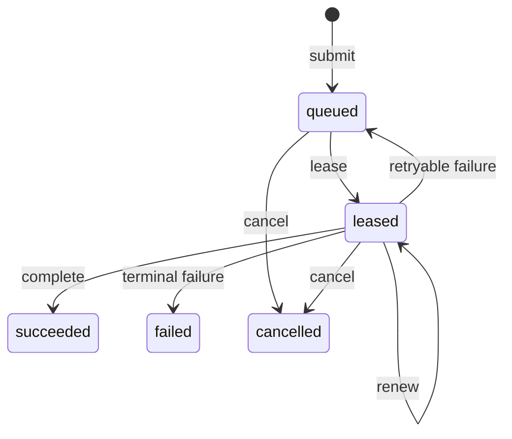

# Mahoraga task relay protocol 3.0.1

Protocol 3.0.1 defines the provider-neutral state machine that will back the
authenticated cloud relay. The current foundation implements and pressure-tests
the contract in memory; it does not expose a public listener or claim that a
cloud data store has been activated.

## Delivery semantics

The transport is **at-least-once**. A client or runner may repeat an operation
after a timeout, process restart, or lost response. Mahoraga makes those repeats
safe through idempotent effects rather than claiming literal exactly-once
delivery.

Every logical submission has:

- a caller-selected idempotency key;
- a canonical normalized request;
- a SHA-256 request hash;
- a deterministic task ID derived from the key and hash;
- a bounded attempt ceiling;
- a monotonically increasing fencing token.

Repeating a key with the same normalized request returns the existing task.
Repeating the key with a different request fails with an idempotency conflict.

## State machine

Only the active runner and current fencing token may renew, complete, or fail a
lease. Completion after expiry or reassignment is rejected. Terminal retries
must reproduce the same bounded evidence or fail as a replay conflict.

## Logical operations

| Operation | Contract |
| --- | --- |
| Submit | Normalize, hash, create once, or return the identical task. |
| Lease | Increment attempt and fencing token; set a bounded expiry. |
| Renew | Require the active runner and token; extend without changing identity. |
| Complete | Require a live lease and content-free repository receipt. |
| Fail | Require a live lease; requeue only while retryable and below the ceiling. |
| Cancel | Invalidate any lease and enter an immutable terminal state. |
| Status | Return bounded state and expiry metadata without task content. |

## Persistence adapter

`src/task-relay-store.mjs` is the first durable adapter. It keeps protocol 3.0.1
records in a local SQLite WAL file:

- submit and lease run inside `BEGIN IMMEDIATE` transactions;
- idempotency keys are unique;
- request hashes are immutable;
- updates are conditional on the current fencing token and status;
- crash/reopen recovers the same logical tasks.

The store persists bounded metadata, hashes, paths, counts, timestamps, and
content-free receipts. It does not persist credentials, prompts, model output,
chat transcripts, or attachment bytes. It still does not expose a public
listener or a cloud SDK.

## Pressure-test baseline

The deterministic suite covers duplicate submission, key reuse conflict, active
lease contention, expiry/reassignment, stale completion, replay conflict,
bounded attempts, retryable failure, terminal failure, cancellation, traversal,
credential-shaped metadata, and tampered hashes.
