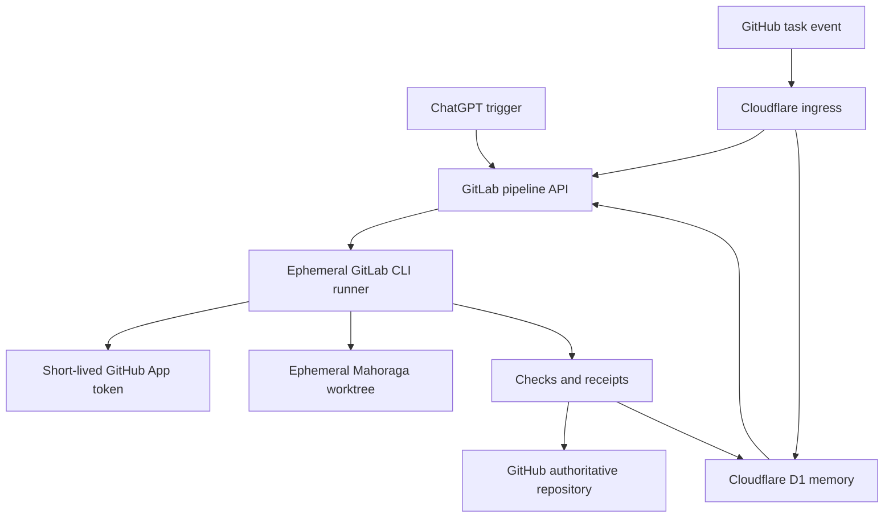
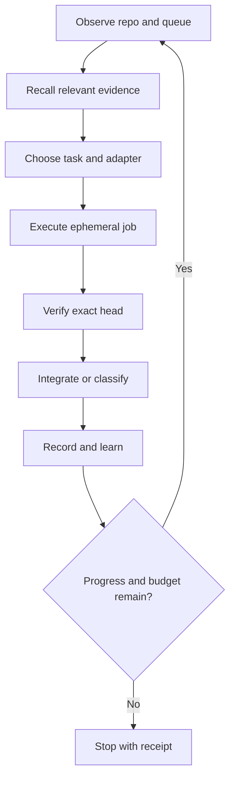

# Cloud CLI Broker, Adaptive Loop, and Project Memory Design

**Status:** Approved design  
**Date:** 2026-09-07  
**Repositories:** `michaeljwilliams0123/mahoraga` (authoritative product) and GitLab project `85885826` (private assurance/execution plane)

## 1. Decision summary

Mahoraga will add a third-party cloud CLI subsystem with:

- Cloudflare Workers as the always-available ingress and Cloudflare D1 as durable structured memory.
- The existing private GitLab assurance project as the broker and ephemeral full-shell execution plane.
- Two task-entry routes: ChatGPT-triggered GitLab pipelines and owner-authored GitHub task events delivered through Cloudflare.
- A repository-scoped GitHub App that mints short-lived installation tokens per job.
- Raw shell execution for the initial release, isolated from the local Mahoraga supervisor and controlled by a single kill switch.
- Policy-driven automatic landing for ordinary exact-head verified PRs.
- Protected-root changes retained as reviewed bootstrap PRs.
- A bounded adaptive execution loop that can scale to 16 logical lanes and 100 cycles per objective.
- Full project memory with layered compaction, provenance, confidence, expiry, and supersession.
- A hard-zero-dollar operating boundary: capacity exhaustion stops work instead of purchasing or falling back to metered services.

GitHub remains the authoritative source of product code and merge truth. GitLab is the private execution and independent assurance plane. Cloudflare is ingress and memory, never a repository authority.

## 2. Goals

1. Provide a real cloud Linux CLI with Git, GitHub CLI, Node.js 24, Python, and repository test tooling.
2. Let ChatGPT and owner-authored GitHub events submit tasks through one validated contract.
3. Preserve full-shell flexibility without exposing an unrestricted shell from the local Mahoraga supervisor.
4. Create branches, commits, PRs, verification evidence, and eligible automatic merges against GitHub.
5. Remember objectives, decisions, repository observations, failures, repairs, and proven patterns across runs.
6. Iterate autonomously while retaining bounded execution, idempotency, exact-head verification, and owner stop authority.
7. Add future cloud CLI providers through versioned adapters rather than redesigning the broker.
8. Operate with no incremental monetary charge and no paid fallback.

## 3. Non-goals

- No public tunnel, reverse proxy, port forwarding, or inbound connection to a personal device.
- No unrestricted shell inside the local Mahoraga supervisor.
- No direct pushes to GitHub `main`.
- No force-push, administrator override, branch-protection bypass, or arbitrary ruleset modification.
- No permanent personal GitHub token in source, logs, task envelopes, Cloudflare, or ChatGPT.
- No automated PR reviews, review comments, conversation comments, or reactions.
- No memory record may grant permissions, become executable authority, or override current repository policy.
- No automatic purchase, plan upgrade, or metered-provider fallback.

## 4. System architecture



### 4.1 Cloudflare ingress

The ingress:

- Accepts only the configured GitHub webhook endpoint.
- Verifies the GitHub webhook signature before parsing task instructions.
- Requires the repository identity `michaeljwilliams0123/mahoraga`.
- Requires an allowlisted owner actor and configured task marker/label.
- Rejects unknown events, oversized bodies, expired tasks, duplicate delivery IDs, and replayed nonces.
- Converts accepted events to the canonical task envelope.
- Triggers a protected GitLab `main` pipeline.
- Records acceptance or rejection in D1.
- Holds a GitLab trigger secret but no GitHub write credential.
- Exposes no shell, repository browser, generic proxy, or caller-selected network destination.

### 4.2 GitLab broker

The existing private project `mahoraga_mw-group/Mahoraga_MW-project` remains the independent assurance plane and gains the cloud CLI stages.

The broker:

- Accepts pipeline tasks only from the connected ChatGPT GitLab integration or Cloudflare ingress.
- Starts all credential-bearing jobs from protected GitLab `main`.
- Validates the task schema, source, actor, repository, expiry, nonce, command size, requested base SHA, and policy version.
- Claims each task exactly once.
- Selects the worker adapter and allocates an execution lease.
- Emits GitLab job logs and digest-chained artifacts whose hashes are copied into the durable receipt.
- Updates D1 through the authenticated ingress API after each state transition.
- Never treats its mirrored source tree as GitHub merge truth.

### 4.3 Ephemeral full-shell worker

The worker image is pinned by digest and contains:

- Node.js 24
- Python 3
- Git
- GitHub CLI
- `jq`
- the Mahoraga landing helper and receipt tooling

Each job:

1. Starts as a non-root user with no Docker socket and no `sudo`.
2. Creates a fresh fixed working directory.
3. Mints a short-lived GitHub App installation token.
4. Clones only the approved GitHub repository and checks out the requested base or head SHA.
5. Runs the raw shell command through `bash --noprofile --norc -euo pipefail` with a hard timeout and bounded output.
6. Captures status, diff metadata, tests, commits, branch, PR, and exact-head verification.
7. Revokes or abandons the short-lived token and destroys the worktree at job completion.

Raw shell is enabled only when `CLOUD_CLI_RAW_SHELL_ENABLED=true`. Disabling that variable leaves health, typed inspection, verification, and receipt operations available.

## 5. Canonical task envelope

Every route produces schema version 1 with these fields:

| Field | Requirement |
|---|---|
| `schemaVersion` | Exactly `1` |
| `taskId` | Globally unique immutable identifier |
| `objectiveId` | Existing or new project objective |
| `source` | `chatgpt-gitlab` or `github-event` |
| `actor` | Verified submitting identity |
| `repository` | Exactly `michaeljwilliams0123/mahoraga` |
| `baseRef` | Approved base branch |
| `baseSha` | Optional exact starting SHA; required for landing tasks |
| `commandBase64` | Raw UTF-8 shell command encoded as Base64 |
| `requestedCapabilities` | Declared operation capabilities |
| `maximumRuntimeSeconds` | Positive integer within policy ceiling |
| `maximumOutputBytes` | Positive integer within policy ceiling |
| `expiresAt` | UTC timestamp |
| `deliveryId` | Source delivery identifier |
| `nonce` | Unique anti-replay value |
| `policyVersion` | Required policy contract version |

Unknown fields are rejected. Commands containing NUL bytes are rejected. Decoded commands and task bodies have fixed size limits. The envelope is stored with a command digest; raw command content is retained only under the raw-event retention policy.

## 6. Authentication and secrets

### 6.1 GitHub App

A repository-scoped GitHub App is installed only on Mahoraga. Minimum permissions are:

- Metadata: read
- Contents: read and write
- Pull requests: read and write
- Actions: read
- Checks: read and write

The App private key, App ID, and installation ID are stored only as masked, protected GitLab CI/CD variables scoped to the `github-repair` environment. The job mints an installation token only after task validation. Tokens are never returned to Cloudflare, ChatGPT, D1, GitHub issues, artifacts, or logs.

### 6.2 Cloudflare-to-GitLab

Cloudflare stores only the GitLab pipeline-trigger credential and GitHub webhook secret. The trigger is fixed to the private GitLab project and protected `main` ref. It cannot choose another GitLab project or ref.

### 6.3 ChatGPT-to-GitLab

ChatGPT submits tasks through the connected GitLab integration using the GitLab pipeline API. Pipeline inputs use the same schema and validation as GitHub-originated tasks. The integration does not receive the GitHub App private key or installation token.

### 6.4 Raw-shell risk acceptance

An authenticated raw shell that receives repository-write credentials can theoretically inspect or misuse its temporary token. The design reduces but cannot eliminate that risk through:

- owner identity allowlisting;
- protected-branch-only credential release;
- single-use task claims;
- short token lifetime;
- repository-only App installation;
- ephemeral non-root runners;
- no Docker socket or privileged mode;
- strict runtime and output ceilings;
- immutable receipts;
- immediate kill switch;
- branch protection and separate landing policy;
- server-side GitHub rulesets that prohibit force pushes and branch deletion on `main` and the cloud-worker branch namespace, without granting the App bypass authority.

## 7. Git and pull-request policy

Raw shell jobs may:

- inspect repository history and status;
- run package installation and repository tests;
- edit files in the ephemeral worktree;
- create commits;
- create and push branches using eligible prefixes;
- open and update pull requests;
- request automatic integration;
- create GitHub check-run results and GitLab receipt artifacts.

Raw shell jobs may not:

- push directly to `main`;
- force-push or delete protected worker branches; these prohibitions are enforced by server-side GitHub rulesets because a raw shell cannot reliably enforce a client-side Git wrapper;
- use administrator merge or bypass protections;
- modify GitHub rulesets or repository administration;
- write secrets into repository files, logs, issues, PRs, comments, or artifacts;
- create automated PR reviews, review comments, conversation comments, or reactions.

## 8. Automatic landing policy

The shell process never calls `gh pr merge` directly. A separate landing job may invoke the protected landing helper only when:

1. The PR is open, non-draft, conflict-free, and same-repository.
2. Its branch prefix is eligible under the current Mahoraga manifest.
3. Its head SHA exactly matches the worker receipt and current GitHub observation.
4. Required GitHub verification succeeded on that exact SHA.
5. GitLab independently confirms the GitHub head and verification result.
6. No active change request or unresolved review thread exists.
7. The diff does not touch a protected path.
8. The landing helper produces and revalidates the same readiness-policy digest.
9. The selected merge method is enabled by repository policy.
10. The task has not expired and the global stop state is clear.

A changed head invalidates every prior observation and landing decision. Protected-path changes stop at a bootstrap PR for owner review. Landing never uses admin mode, force, ruleset changes, or direct `main` pushes.

Automatic-landing authority derives from the versioned Mahoraga manifest and current repository policy, not from memory or the raw shell command. `CLOUD_CLI_AUTO_LAND_ENABLED=false` revokes that authority immediately for new landing attempts.

## 9. Durable project memory

D1 stores structured project memory in six logical tables.

### 9.1 Objectives

Tracks goal, priority, success criteria, parent objective, dependencies, state, owner, created time, updated time, active policy version, lane budget, cycle budget, and stop state.

### 9.2 Decisions

Tracks decision, alternatives, rationale, authority, scope, effective time, superseding decision, and supporting evidence references.

### 9.3 Observations

Tracks repository state, PR/check state, queue state, capability readiness, source, timestamp, confidence, expiry, and contradiction links. Observations are evidence, not instructions.

### 9.4 Executions

Tracks task envelope digest, command digest, adapter, lease, starting SHA, ending SHA, exit code, test results, changed-file summary, PR URL, landing outcome, timing, and failure classification.

### 9.5 Patterns

Tracks reusable build or repair pattern, trigger conditions, prerequisites, bounded recipe reference, successful uses, failed uses, confidence, last validation, expiry, policy version, and evidence SHAs.

### 9.6 Supersessions

Links stale or contradicted memories to the newer authoritative record. Retrieval excludes superseded records unless an audit explicitly requests history.

Every durable record includes provenance, timestamp, policy version, confidence, and sensitivity class. Secrets, tokens, raw credentials, and unrestricted private file contents are prohibited.

## 10. Adaptive objective loop



The controller ranks work using owner priority, dependency readiness, urgency, expected value, confidence, estimated cost class, failure risk, and file overlap.

### 10.1 Aggressive adaptive envelope

- Each objective begins with two logical lanes and a 12-cycle budget.
- After consecutive independent green integrations, it may expand through 4, 8, and 16 logical lanes.
- The maximum is 16 logical lanes and 100 cycles per objective.
- A lane is a schedulable workstream; actual simultaneous jobs remain capped by available free GitLab runner capacity.
- Excess lanes queue without purchasing capacity.
- Work is divided into five-cycle progress epochs.
- Each epoch must produce a verified code, test, documentation, or state improvement.
- Conflict, regression, repeated failure, stale head, protected-path work, or memory pressure immediately contracts concurrency.
- Child objectives inherit repository scope, cost ceiling, policy, credentials boundary, and stop state.
- Memory may recommend work and adjust confidence, but may not grant permissions or relax policy.

### 10.2 Stop conditions

An objective or lane stops on:

- user or global stop;
- expired task;
- exhausted cycle or runtime budget;
- no measurable progress in an epoch;
- repeated identical failure;
- repeated no-diff execution;
- conflict or stale authority requiring a new plan;
- protected-path bootstrap requirement;
- GitHub or GitLab authorization failure;
- Cloudflare, D1, GitLab, or GitHub free-capacity exhaustion;
- policy digest mismatch;
- memory schema or contract digest mismatch.

No stop condition activates a paid fallback.

## 11. Memory retention and compaction

Layered compaction is mandatory under the zero-dollar boundary.

- Raw task events, decoded commands, and verbose command output: 30 days.
- GitLab job artifacts: provider retention policy, with concise receipt copied to D1.
- Immutable concise receipts and repository state transitions: retained indefinitely within storage limits.
- Objectives, decisions, dependencies, and unresolved blockers: retained until explicitly superseded.
- Proven patterns: retained while their validation remains current; confidence decays when unused or contradicted.
- Sanitized monthly memory snapshots: committed through normal PRs with no secrets or raw logs.

At 70% of the configured D1 storage ceiling, compaction runs before accepting low-priority work. At 90%, new low-priority observations stop; required execution receipts continue. At the hard provider limit, memory writes and dependent execution fail closed. Compaction never deletes active objectives, unsuperseded decisions, security events, or receipts required by open PRs.

## 12. Extensibility

Cloud CLI providers implement:

```text
probe -> prepare -> execute -> collect -> destroy
```

Each adapter declares:

- provider ID and version;
- capabilities;
- cost class;
- authentication class;
- supported repository operations;
- isolation level;
- maximum runtime and output;
- concurrency;
- readiness probe;
- cleanup guarantee;
- receipt fields;
- failure taxonomy.

A new adapter cannot run until its contract tests, readiness probe, cost boundary, and cleanup canary succeed. The GitLab adapter is the first implementation. Provider selection never changes the task's permissions or GitHub landing requirements.

Memory schemas and task schemas are independently versioned. Migrations are forward-only, checksum-verified, and reversible through exported snapshots. Operational GitLab files embed the SHA-256 digest of the authoritative GitHub contract; mismatch blocks execution.

## 13. Failure handling

Failures are classified as:

- `ingress_auth`
- `replay`
- `schema`
- `policy`
- `quota`
- `github_app_auth`
- `checkout`
- `command`
- `timeout`
- `verification`
- `conflict`
- `protected_path`
- `landing`
- `receipt`
- `memory`
- `provider`

Retries occur only for classified transient provider or network failures and use bounded exponential backoff with idempotent task claims. Command, policy, authentication, conflict, protected-path, verification, and quota failures do not retry automatically without a changed input or state.

A receipt is attempted for every terminal state. If D1 is unavailable, GitLab retains the artifact and marks memory synchronization pending. A later reconciliation job may copy the existing receipt; it may not rerun the shell command.

## 14. Verification strategy

### 14.1 Contract tests

- valid and invalid task envelopes;
- unknown-field rejection;
- signature verification;
- actor and repository allowlists;
- expiry, nonce, and delivery replay;
- command decoding and size limits;
- policy and contract digest mismatch;
- protected-variable release conditions;
- raw-shell kill switch;
- direct-`main` and force-push rejection;
- timeout and output limits;
- secret redaction;
- receipt completeness;
- memory provenance, confidence, expiry, and supersession;
- compaction safety;
- adaptive lane expansion and contraction;
- progress-epoch stopping;
- exact-head landing invalidation.

### 14.2 Integration tests

- ChatGPT-originated GitLab pipeline with a harmless read command.
- GitHub-originated signed fixture passing through Cloudflare to a GitLab test pipeline.
- Ephemeral clone at an exact SHA.
- GitHub App token mint against the installed repository.
- Branch creation and draft PR creation in a test fixture repository or dedicated canary branch.
- Independent GitHub and GitLab verification agreement.
- D1 receipt creation and memory retrieval.
- Worker teardown and credential expiry.

### 14.3 Production canary

The first Mahoraga canary performs a documentation-only change on an eligible `cloud-cli/canary-*` branch, runs all required verification, opens a PR, writes receipts, exercises automatic landing if the diff is outside protected paths, confirms the merged exact head, and destroys the worker. Any mismatch disables raw shell and automatic landing until repaired.

No Codex review or automated PR communication is generated.

## 15. Planned file ownership

### Authoritative GitHub repository

- `docs/superpowers/specs/2026-09-07-cloud-cli-memory-broker-design.md`
- `contracts/cloud-cli-task.schema.json`
- `src/cloud-cli-policy.mjs`
- `src/cloud-cli-memory-contract.mjs`
- `src/cloud-cli-adapter-contract.mjs`
- `test/cloud-cli-policy.test.mjs`
- `test/cloud-cli-memory-contract.test.mjs`
- `test/cloud-cli-adapter-contract.test.mjs`
- `mahoraga.manifest.json`

### Private GitLab assurance project

- `.gitlab-ci.yml`
- `scripts/cloud-cli-validate.mjs`
- `scripts/github-app-token.mjs`
- `scripts/cloud-cli-run.sh`
- `scripts/cloud-cli-land.mjs`
- `scripts/cloud-cli-receipt.mjs`
- `scripts/cloud-cli-memory-sync.mjs`
- `cloudflare/src/index.ts`
- `cloudflare/schema.sql`
- `cloudflare/wrangler.jsonc`
- `test/cloud-cli-*.test.mjs`

## 16. Rollout order

1. Commit contracts and deterministic tests with all execution disabled.
2. Add D1 schema and local fixture tests.
3. Add Cloudflare ingress with GitLab triggering disabled.
4. Add GitLab typed health/inspection jobs.
5. Configure the GitHub App and validate token minting.
6. Enable ephemeral raw shell for harmless read-only canaries.
7. Enable branch and PR writes.
8. Enable ordinary automatic landing after an exact-head documentation canary.
9. Enable memory promotion and retrieval.
10. Enable adaptive looping at 2 lanes and 12 cycles.
11. Expand maximums through 4, 8, and 16 lanes only after green evidence.
12. Enable the 100-cycle ceiling for decomposable objectives.
13. Keep the global stop, raw-shell kill switch, auto-landing switch, and memory-promotion switch independently controllable.

## 17. Acceptance criteria

The design is complete when:

- both trigger routes produce the same validated task schema;
- an ephemeral GitLab runner executes a raw shell command against the approved GitHub repository;
- the worker uses a short-lived GitHub App token and leaves no persistent token;
- direct `main`, force, admin, and protection bypass paths are absent;
- an ordinary exact-head green PR can land automatically through the protected helper;
- a protected-path PR stops for review;
- D1 recalls an objective, decision, execution, and proven pattern with provenance;
- replayed, expired, mismatched, over-budget, and quota-exhausted work fails closed;
- memory compaction preserves active objectives, durable decisions, and required receipts;
- the loop scales adaptively up to 16 logical lanes and 100 cycles without purchasing capacity;
- stop controls cancel queued work and prevent new work;
- the full verification suite passes on the exact implementation head;
- the production canary completes and confirms worker destruction.

## 18. Operational controls

Independent switches:

- `CLOUD_CLI_ENABLED`
- `CLOUD_CLI_RAW_SHELL_ENABLED`
- `CLOUD_CLI_GITHUB_EVENT_ENABLED`
- `CLOUD_CLI_CHATGPT_TRIGGER_ENABLED`
- `CLOUD_CLI_WRITE_ENABLED`
- `CLOUD_CLI_AUTO_LAND_ENABLED`
- `CLOUD_CLI_MEMORY_PROMOTION_ENABLED`
- `CLOUD_CLI_ADAPTIVE_LOOP_ENABLED`
- `CLOUD_CLI_GLOBAL_STOP`

The global stop overrides every enable flag. Disabling raw shell preserves typed read-only health and verification. Disabling auto-land preserves branch and PR creation. Disabling memory promotion preserves receipts and current objective state.
